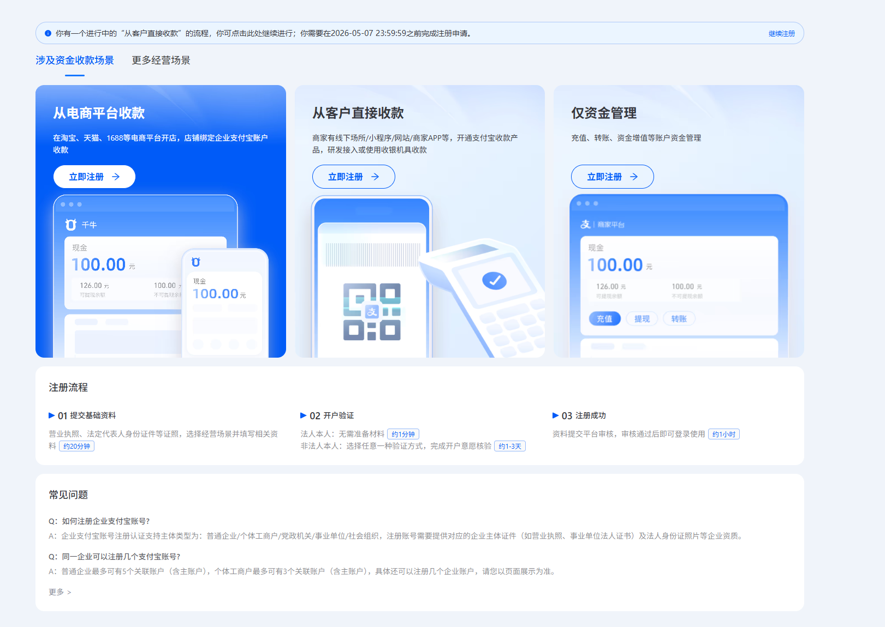
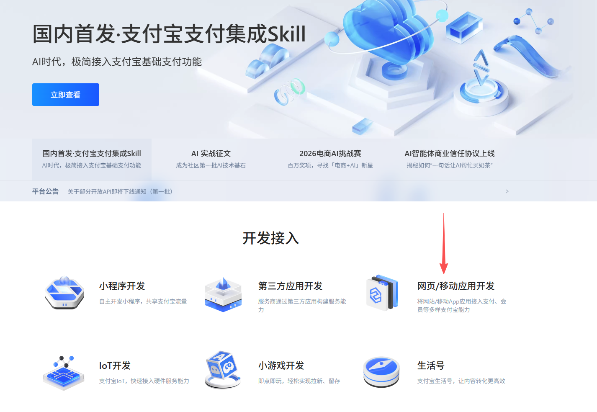
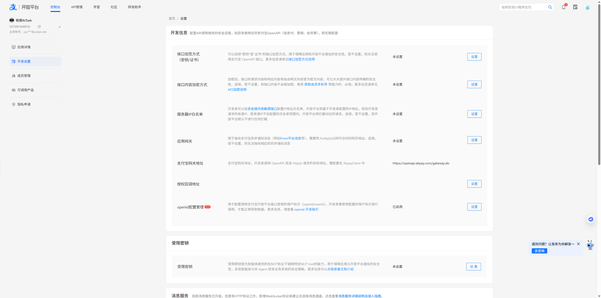

# 一、对接支付宝获取相关配置

1. 进入支付宝商家平台：https://b.alipay.com/page/settle-b/launcher/scene-guide，按照你的需求创建对应的商家账号

   

2. 进入支付宝开发平台：https://open.alipay.com/，创建应用并且发布

   注意，在开放平台登录的时候，一定要使用在第一步中创建的支付宝账号，比如第一步创建的是企业账号，开放平台扫码登录也要用这个，不要直接拿自己的其他个人账号直接登录。

   创建应用的时候，选择上一步中注册好的商家账号。

   

   开发配置：

   接口加签方式使用默认的rsa2即可

   接口内容加密方式选择默认的

   服务器IP白名单填写你的服务器具体部署ip

   应用网关不需要配置

   授权回调地址需要配置

   

3. 应用发布过程中需要审核，如果急着上线测试，可以先试用支付宝沙箱功能：https://open.alipay.com/develop/sandbox/app。

   支付宝沙箱功能，应用、买家账户、卖家账号都需要使用沙箱账号，还需要在沙箱工具下载对应的沙箱版本支付宝app才行。